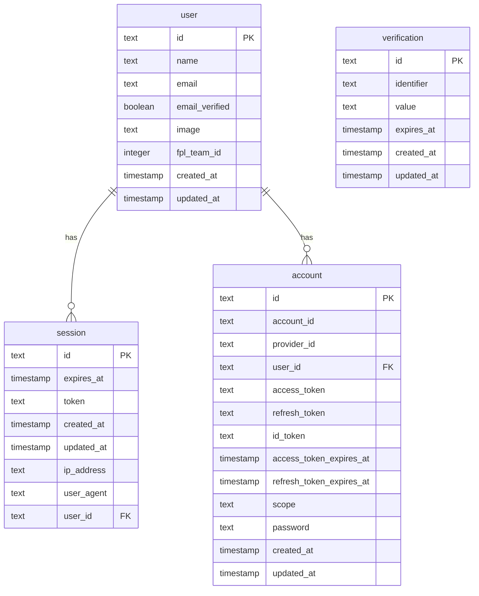

# Database Schema

> Auto-maintained alongside `proxy/src/db/schema.ts`.
> **Rule:** any change to `schema.ts` must update this file in the same PR.
> For interactive browsing run `npm run db:studio -w proxy` (Drizzle Studio on `https://local.drizzle.studio`).

## Tables

### `user`

Stores registered user accounts. Extended from better-auth's base schema with `fpl_team_id`.

| Column | Type | Nullable | Notes |
|--------|------|----------|-------|
| `id` | text | NO | Primary key (better-auth generated) |
| `name` | text | NO | Display name |
| `email` | text | NO | Unique |
| `email_verified` | boolean | NO | Default false |
| `image` | text | YES | Avatar URL |
| `fpl_team_id` | integer | YES | User's saved FPL team ID |
| `created_at` | timestamp | NO | |
| `updated_at` | timestamp | NO | |

### `session`

Active user sessions managed by better-auth.

| Column | Type | Nullable | Notes |
|--------|------|----------|-------|
| `id` | text | NO | Primary key |
| `expires_at` | timestamp | NO | Session expiry (30 days) |
| `token` | text | NO | Unique session token |
| `created_at` | timestamp | NO | |
| `updated_at` | timestamp | NO | |
| `ip_address` | text | YES | |
| `user_agent` | text | YES | |
| `user_id` | text | NO | FK → `user.id` (cascade delete) |

### `account`

OAuth provider accounts and password credentials, managed by better-auth.

| Column | Type | Nullable | Notes |
|--------|------|----------|-------|
| `id` | text | NO | Primary key |
| `account_id` | text | NO | Provider's account ID |
| `provider_id` | text | NO | e.g. `google`, `credential` |
| `user_id` | text | NO | FK → `user.id` (cascade delete) |
| `access_token` | text | YES | OAuth access token |
| `refresh_token` | text | YES | OAuth refresh token |
| `id_token` | text | YES | OAuth ID token |
| `access_token_expires_at` | timestamp | YES | |
| `refresh_token_expires_at` | timestamp | YES | |
| `scope` | text | YES | OAuth scopes |
| `password` | text | YES | Argon2id hash (email/password accounts) |
| `created_at` | timestamp | NO | |
| `updated_at` | timestamp | NO | |

### `verification`

Email verification tokens.

| Column | Type | Nullable | Notes |
|--------|------|----------|-------|
| `id` | text | NO | Primary key |
| `identifier` | text | NO | Email address |
| `value` | text | NO | Verification token |
| `expires_at` | timestamp | NO | |
| `created_at` | timestamp | YES | |
| `updated_at` | timestamp | YES | |

## ER Diagram

