# Database Schema

> Auto-maintained alongside `proxy/src/db/schema.ts`.
> **Rule:** any change to `schema.ts` must update this file in the same PR.
> For interactive browsing run `npm run db:studio -w proxy` (Drizzle Studio on `https://local.drizzle.studio`).

## Tables

### `user`

Stores registered user accounts. Extended from better-auth's base schema with `fpl_team_id`.

| Column | Type | Nullable | Notes |
|--------|------|----------|-------|
| `id` | text | NO | Primary key (better-auth generated) |
| `name` | text | NO | Display name |
| `email` | text | NO | Unique |
| `email_verified` | boolean | NO | Default false |
| `image` | text | YES | Avatar URL |
| `fpl_team_id` | integer | YES | User's saved FPL team ID |
| `subscription_tier` | text | NO | `free` (default) or `premium` — gates squad-scoped price views |
| `created_at` | timestamp | NO | |
| `updated_at` | timestamp | NO | |

### `session`

Active user sessions managed by better-auth.

| Column | Type | Nullable | Notes |
|--------|------|----------|-------|
| `id` | text | NO | Primary key |
| `expires_at` | timestamp | NO | Session expiry (30 days) |
| `token` | text | NO | Unique session token |
| `created_at` | timestamp | NO | |
| `updated_at` | timestamp | NO | |
| `ip_address` | text | YES | |
| `user_agent` | text | YES | |
| `user_id` | text | NO | FK → `user.id` (cascade delete) |

### `account`

OAuth provider accounts and password credentials, managed by better-auth.

| Column | Type | Nullable | Notes |
|--------|------|----------|-------|
| `id` | text | NO | Primary key |
| `account_id` | text | NO | Provider's account ID |
| `provider_id` | text | NO | e.g. `google`, `credential` |
| `user_id` | text | NO | FK → `user.id` (cascade delete) |
| `access_token` | text | YES | OAuth access token |
| `refresh_token` | text | YES | OAuth refresh token |
| `id_token` | text | YES | OAuth ID token |
| `access_token_expires_at` | timestamp | YES | |
| `refresh_token_expires_at` | timestamp | YES | |
| `scope` | text | YES | OAuth scopes |
| `password` | text | YES | Argon2id hash (email/password accounts) |
| `created_at` | timestamp | NO | |
| `updated_at` | timestamp | NO | |

### `verification`

Email verification tokens.

| Column | Type | Nullable | Notes |
|--------|------|----------|-------|
| `id` | text | NO | Primary key |
| `identifier` | text | NO | Email address |
| `value` | text | NO | Verification token |
| `expires_at` | timestamp | NO | |
| `created_at` | timestamp | YES | |
| `updated_at` | timestamp | YES | |

### `watchlist_entry`

Manager team IDs followed by a user (manager watchlist).

| Column | Type | Nullable | Notes |
|--------|------|----------|-------|
| `id` | text | NO | Primary key (`crypto.randomUUID()`) |
| `user_id` | text | NO | FK → `user.id` (cascade delete) |
| `team_id` | integer | NO | FPL team ID being followed |
| `created_at` | timestamp | NO | Default now() |

Unique index on `(user_id, team_id)` prevents duplicates.

### `player_watchlist_entry`

Player IDs shortlisted by a user (player watchlist).

| Column | Type | Nullable | Notes |
|--------|------|----------|-------|
| `id` | text | NO | Primary key (`crypto.randomUUID()`) |
| `user_id` | text | NO | FK → `user.id` (cascade delete) |
| `player_id` | integer | NO | FPL player ID being tracked |
| `created_at` | timestamp | NO | Default now() |

Unique index on `(user_id, player_id)` prevents duplicates.

### `transfer_draft`

One transfer planner draft per user (upsert on `user_id`).

| Column | Type | Nullable | Notes |
|--------|------|----------|-------|
| `user_id` | text | NO | PK, FK → `user.id` (cascade delete) |
| `team_id` | integer | NO | User's FPL team when saved |
| `target_gw` | integer | NO | Gameweek the plan targets |
| `saved_at` | timestamp | NO | Client `savedAt` |
| `free_transfers` | integer | NO | FT count at save time |
| `chip` | text | NO | `none`, `wildcard`, or `freehit` |
| `swaps` | jsonb | NO | `TransferSwap[]` |
| `subs` | jsonb | NO | `SubSwap[]` |
| `updated_at` | timestamp | NO | Server write time |

### `fpl_meta`

Active FPL season tracker. One row per season, created on first bootstrap fetch.

| Column | Type | Nullable | Notes |
|--------|------|----------|-------|
| `season` | text | NO | PK, e.g. `"2025-26"` — derived from GW1 deadline year |
| `is_complete` | boolean | NO | `true` when GW38 `finished=true AND data_checked=true` |
| `created_at` | timestamp | NO | Default now() |

### `fpl_bootstrap_cache`

Persists `bootstrap-static` responses. Old season rows are archived, never deleted.

| Column | Type | Nullable | Notes |
|--------|------|----------|-------|
| `id` | serial | NO | PK |
| `season` | text | NO | FK → `fpl_meta.season` |
| `data` | jsonb | NO | Full `bootstrap-static` response |
| `fetched_at` | timestamp | NO | |
| `archived` | boolean | NO | `true` after season rollover; never read when archived |

### `fpl_gw_live_cache`

Persists `event/{gw}/live/` responses. Frozen once `data_checked=true` — never re-fetched.

| Column | Type | Nullable | Notes |
|--------|------|----------|-------|
| `season` | text | NO | PK component |
| `gw` | integer | NO | PK component |
| `data` | jsonb | NO | Full live response |
| `frozen` | boolean | NO | `true` once `data_checked=true`; row never updated after |
| `fetched_at` | timestamp | NO | |

### `fpl_squad_cache`

Persists `entry/{teamId}/event/{gw}/picks/` responses. Frozen once `data_checked=true`.

| Column | Type | Nullable | Notes |
|--------|------|----------|-------|
| `season` | text | NO | PK component |
| `team_id` | integer | NO | PK component |
| `gw` | integer | NO | PK component |
| `data` | jsonb | NO | Full picks response |
| `frozen` | boolean | NO | `true` once `finished=true AND data_checked=true` |
| `fetched_at` | timestamp | NO | |

### `fpl_dream_team_cache`

Persists `dream-team/{gw}/` responses. Frozen once GW is finished.

| Column | Type | Nullable | Notes |
|--------|------|----------|-------|
| `season` | text | NO | PK component |
| `gw` | integer | NO | PK component |
| `data` | jsonb | NO | Full dream-team response |
| `frozen` | boolean | NO | `true` once `event.finished=true` |
| `fetched_at` | timestamp | NO | |

### `fpl_history_cache`

Persists `entry/{teamId}/history/` responses. Refreshed only when a new GW has been finished since last fetch.

| Column | Type | Nullable | Notes |
|--------|------|----------|-------|
| `season` | text | NO | PK component |
| `team_id` | integer | NO | PK component |
| `data` | jsonb | NO | Full history response |
| `last_finished_gw` | integer | NO | Latest finished GW at fetch time; re-fetch trigger |
| `fetched_at` | timestamp | NO | |

### `fpl_transfers_cache`

Persists `entry/{teamId}/transfers/` responses. Same refresh logic as `fpl_history_cache`.

| Column | Type | Nullable | Notes |
|--------|------|----------|-------|
| `season` | text | NO | PK component |
| `team_id` | integer | NO | PK component |
| `data` | jsonb | NO | Full transfers response |
| `last_finished_gw` | integer | NO | Latest finished GW at fetch time |
| `fetched_at` | timestamp | NO | |

### `fpl_element_summary_cache`

Persists FPL `element-summary/{id}/` for predicted lineups and player profile. Six-hour TTL;
background warmup fills rows after proxy start.

| Column | Type | Nullable | Notes |
|--------|------|----------|-------|
| `season` | text | NO | PK component |
| `element_id` | integer | NO | PK component |
| `data` | jsonb | NO | Full element-summary response |
| `fetched_at` | timestamp | NO | |

## ER Diagram

```mermaid
erDiagram
    user {
        text id PK
        text name
        text email
        boolean email_verified
        text image
        integer fpl_team_id
        text subscription_tier
        timestamp created_at
        timestamp updated_at
    }
    session {
        text id PK
        timestamp expires_at
        text token
        timestamp created_at
        timestamp updated_at
        text ip_address
        text user_agent
        text user_id FK
    }
    account {
        text id PK
        text account_id
        text provider_id
        text user_id FK
        text access_token
        text refresh_token
        text id_token
        timestamp access_token_expires_at
        timestamp refresh_token_expires_at
        text scope
        text password
        timestamp created_at
        timestamp updated_at
    }
    verification {
        text id PK
        text identifier
        text value
        timestamp expires_at
        timestamp created_at
        timestamp updated_at
    }
    watchlist_entry {
        text id PK
        text user_id FK
        integer team_id
        timestamp created_at
    }
    player_watchlist_entry {
        text id PK
        text user_id FK
        integer player_id
        timestamp created_at
    }
    transfer_draft {
        text user_id PK
        integer team_id
        integer target_gw
        timestamp saved_at
        integer free_transfers
        text chip
        jsonb swaps
        jsonb subs
        timestamp updated_at
    }
    fpl_meta {
        text season PK
        boolean is_complete
        timestamp created_at
    }
    fpl_bootstrap_cache {
        serial id PK
        text season FK
        jsonb data
        timestamp fetched_at
        boolean archived
    }
    fpl_gw_live_cache {
        text season PK
        integer gw PK
        jsonb data
        boolean frozen
        timestamp fetched_at
    }
    fpl_squad_cache {
        text season PK
        integer team_id PK
        integer gw PK
        jsonb data
        boolean frozen
        timestamp fetched_at
    }
    fpl_dream_team_cache {
        text season PK
        integer gw PK
        jsonb data
        boolean frozen
        timestamp fetched_at
    }
    fpl_history_cache {
        text season PK
        integer team_id PK
        jsonb data
        integer last_finished_gw
        timestamp fetched_at
    }
    fpl_transfers_cache {
        text season PK
        integer team_id PK
        jsonb data
        integer last_finished_gw
        timestamp fetched_at
    }

    fpl_element_summary_cache {
        text season PK
        integer element_id PK
        jsonb data
        timestamp fetched_at
    }

    user ||--o{ session : "has"
    user ||--o{ account : "has"
    user ||--o{ watchlist_entry : "follows"
    user ||--o{ player_watchlist_entry : "shortlists"
    user ||--o| transfer_draft : "has"
    fpl_meta ||--o{ fpl_bootstrap_cache : "has"
    fpl_meta ||--o{ fpl_gw_live_cache : "caches"
    fpl_meta ||--o{ fpl_squad_cache : "caches"
    fpl_meta ||--o{ fpl_dream_team_cache : "caches"
    fpl_meta ||--o{ fpl_history_cache : "caches"
    fpl_meta ||--o{ fpl_transfers_cache : "caches"
    fpl_meta ||--o{ fpl_element_summary_cache : "caches"
```

