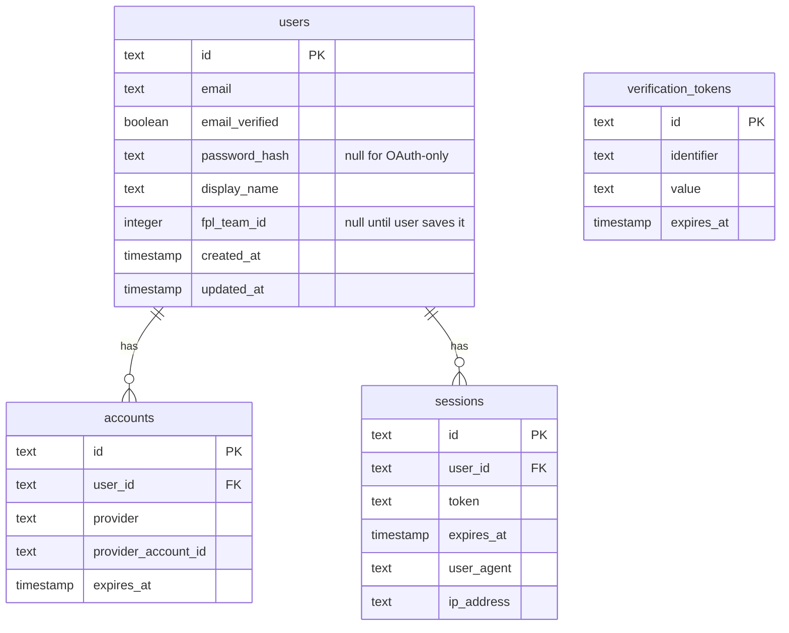

# Database Schema

> Auto-maintained alongside `proxy/src/db/schema.ts`.
> **Rule:** any change to `schema.ts` must update this file in the same PR.
> For interactive browsing run `npm run db:studio -w proxy` (Drizzle Studio on `https://local.drizzle.studio`).

---

## ER Diagram

> This section will be populated in Step 3 of AUTH-01 once the full Drizzle schema is defined.

---

## Tables

### users

| Column           | Type      | Null | Default | Notes                          |
|------------------|-----------|------|---------|--------------------------------|
| id               | text (PK) | no   | —       | better-auth user id            |
| email            | text      | no   | —       | unique                         |
| email_verified   | boolean   | no   | false   |                                |
| password_hash    | text      | yes  | —       | null for OAuth-only users      |
| display_name     | text      | yes  | —       |                                |
| fpl_team_id      | integer   | yes  | —       | AUTH-01: saved FPL team ID     |
| created_at       | timestamp | no   | now()   |                                |
| updated_at       | timestamp | no   | now()   |                                |

**Relations:** `accounts.user_id → users.id`, `sessions.user_id → users.id`

---

### accounts

| Column               | Type      | Null | Default | Notes                        |
|----------------------|-----------|------|---------|------------------------------|
| id                   | text (PK) | no   | —       |                              |
| user_id              | text (FK) | no   | —       | → users.id                   |
| provider             | text      | no   | —       | e.g. `"google"`              |
| provider_account_id  | text      | no   | —       | provider's user identifier   |
| expires_at           | timestamp | yes  | —       | OAuth token expiry           |

---

### sessions

| Column      | Type      | Null | Default | Notes                        |
|-------------|-----------|------|---------|------------------------------|
| id          | text (PK) | no   | —       |                              |
| user_id     | text (FK) | no   | —       | → users.id                   |
| token       | text      | no   | —       | refresh token (hashed)       |
| expires_at  | timestamp | no   | —       | ~30 days from creation       |
| user_agent  | text      | yes  | —       |                              |
| ip_address  | text      | yes  | —       |                              |

---

### verification_tokens

| Column      | Type      | Null | Default | Notes                        |
|-------------|-----------|------|---------|------------------------------|
| id          | text (PK) | no   | —       |                              |
| identifier  | text      | no   | —       | e.g. email address           |
| value       | text      | no   | —       | hashed token                 |
| expires_at  | timestamp | no   | —       |                              |

---

> **How to view live data:**
> - `npm run db:studio -w proxy` — Drizzle Studio (local, reads `DATABASE_URL` from `.env`)
> - Supabase Dashboard → Table editor (cloud)
> - Generated SQL migrations: `proxy/src/db/migrations/*.sql`
