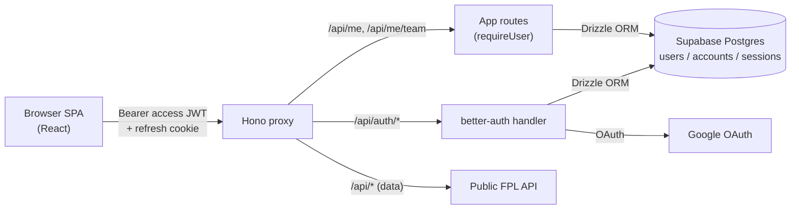

# Design: User Accounts (AUTH-01)

## Current implementation

- Monorepo: `web/` (React + Vite SPA) and `proxy/` (Hono + tsx) per `docs/architecture.md`.
- `proxy/src/index.ts` mounts `/api/*` data routes (gameweeks, entry, leagues, squad,
  transfers, history…) plus `serveStatic('./web/dist')`. Single Hono process on Fly.io
  (`fly.toml`: `shared-cpu-1x`, 256 MB, 1 machine).
- **No database.** `proxy/src/cache.ts` is an in-memory TTL map; ADR 0013 raised but did
  not decide persistence.
- Watchlist storage lives in `web/src/lib/watchlist-repository.ts` behind a
  `WatchlistRepository` interface — designed as the AUTH-01 migration seam, but **out of
  scope** for this change.
- Entry flow: `web/src/screens/EntryScreen/EntryScreen.tsx` takes the FPL team ID via URL
  / local input; no concept of an account anywhere.
- OpenSpec workflow is mandatory (`CLAUDE.md`): proposal → apply → archive. The
  `2026-06-01-manager-watchlist` change is the closest reference structure.

## Key decisions

1. **Database = Supabase Postgres.** Use only the Postgres part; do not adopt Supabase
   Auth. Connect via the standard `postgres` driver + `drizzle-orm` — modern, TS-first,
   zero runtime overhead, aligned with better-auth's officially supported adapters. The
   schema is owned in-repo under `proxy/src/db/`.
2. **Auth library = `better-auth`.** Hono plugin + Drizzle adapter + email/password +
   Google OAuth provider are all first-party. We enable its **JWT plugin** to issue an
   access JWT (memory) alongside better-auth's native refresh cookie — this maps the
   "short-lived JWT access + refresh cookie" model onto the library's built-ins without
   hand-rolling auth.
3. **Session transport = JWT access in memory + HttpOnly refresh cookie.** Access TTL
   15 min; refresh cookie `HttpOnly; Secure; SameSite=Lax; Path=/`, 30-day TTL; refresh
   rotation with reuse detection handled by better-auth.
4. **Login is additive, not required.** All `/api/*` data routes stay unauthenticated;
   only `/api/me` and `/api/me/*` require an access token. Personalised UI is gated
   client-side by `useCurrentUser()` returning a non-null user.
5. **In-scope persistence is intentionally minimal**: only `users`, `accounts`,
   `sessions`, `verification_tokens` (per better-auth schema), plus a single app column
   `users.fpl_team_id`. Watchlist / saved plans / settings tables are deferred.
6. **Spec-first**: no application code lands before this change is approved. Non-
   negotiable per `CLAUDE.md`.
7. **ADRs to add**:
   - `0015-database-postgres.md` — introduces Postgres; supersedes the "not yet" stance
     of ADR 0013 for user data.
   - `0016-auth-better-auth.md` — library choice + JWT plugin rationale.
   - `0017-session-transport-jwt-refresh-cookie.md` — short JWT + refresh cookie model.

## Data models

```ts
// proxy/src/db/schema.ts (excerpt)
export const users = pgTable('users', {
  id: text('id').primaryKey(),
  email: text('email').notNull().unique(),
  emailVerified: boolean('email_verified').notNull().default(false),
  passwordHash: text('password_hash'),       // null for OAuth-only users
  displayName: text('display_name'),
  fplTeamId: integer('fpl_team_id'),         // the single AUTH-01 app field
  createdAt: timestamp('created_at').notNull().defaultNow(),
  updatedAt: timestamp('updated_at').notNull().defaultNow(),
});

export const accounts = pgTable('accounts', {
  /* better-auth shape: provider, providerAccountId, userId, refresh/access tokens, expiresAt */
});
export const sessions = pgTable('sessions', {
  /* better-auth shape: id, userId, token, expiresAt, userAgent, ipAddress */
});
export const verificationTokens = pgTable('verification_tokens', {
  /* better-auth shape */
});
```

## HTTP contracts

```
POST /api/auth/sign-up/email     // { email, password, displayName? } -> 201 + Set-Cookie refresh; body: { accessToken, user }
POST /api/auth/sign-in/email     // { email, password }                -> 200 + Set-Cookie refresh; body: { accessToken, user }
GET  /api/auth/sign-in/social/google?callbackURL=...   // initiates OAuth
GET  /api/auth/callback/google                          // handled by better-auth
POST /api/auth/refresh           // reads refresh cookie -> rotates cookie; body: { accessToken }
POST /api/auth/sign-out          // clears refresh cookie

GET  /api/me                     // 200 { id, email, displayName, fplTeamId } | 401
PUT  /api/me/team                // body: { teamId: number } -> 200 { fplTeamId } | 400 (invalid) | 401
```

## Proposed changes

### Backend (proxy)

- Dependencies: `better-auth`, `better-auth/adapters/drizzle`, `drizzle-orm`, `postgres`,
  `drizzle-kit` (dev).
- New module `proxy/src/db/`:
  - `client.ts` — `postgres()` client (pooled, `max: 4`) + `drizzle()` instance keyed off
    `process.env.DATABASE_URL`.
  - `schema.ts` — Drizzle tables (see Data models).
  - `migrations/` — generated by `drizzle-kit generate`; applied at boot via
    `drizzle-orm/postgres-js/migrator` under an advisory lock.
- New module `proxy/src/auth/`:
  - `auth.ts` — `betterAuth({ database: drizzleAdapter(db), emailAndPassword: { enabled: true }, socialProviders: { google: {…} }, plugins: [jwt()], accountLinking: { byEmail: true } })`.
  - `middleware.ts` — `requireUser` Hono middleware reading the access JWT, setting
    `c.var.user`.
- Mount auth routes: `app.on(['GET', 'POST'], '/api/auth/*', (c) => auth.handler(c.req.raw))`.
- New app routes:
  - `GET /api/me`
  - `PUT /api/me/team` — validates via `entryService.getEntry(teamId)` before
    `UPDATE users SET fpl_team_id = $1`.
  - `POST /api/me/logout` (thin wrapper if not already exposed by better-auth).
- Secrets via `fly secrets set`: `DATABASE_URL`, `BETTER_AUTH_SECRET`,
  `GOOGLE_CLIENT_ID`, `GOOGLE_CLIENT_SECRET`, `PUBLIC_APP_URL`.

### Frontend (web)

- New module `web/src/auth/`:
  - `auth-client.ts` — thin fetch wrapper for `/api/auth/*` + `/api/me`, with a
    401-driven refresh interceptor.
  - `useCurrentUser.ts` — React Query hook over `/api/me`; returns `{ data: User | null }`.
  - `AuthProvider.tsx` — owns the in-memory access token and bootstraps it from a
    `/api/auth/refresh` call on app start.
  - `ProtectedRoute.tsx` — for MGR-02 (no visible routes use it in this change).
- New screens: `web/src/screens/SignInScreen/` and `web/src/screens/SignUpScreen/`
  (no barrel re-exports per `CLAUDE.md`).
- New `web/src/components/ui/UserMenu/UserMenu.tsx` — signed-in user + logout action.
- `EntryScreen`: when a user is logged in and has no `fplTeamId`, show a "Save to
  account" affordance that calls `PUT /api/me/team`; when logged in with a saved
  `fplTeamId`, pre-fill the input.
- Header / nav: Sign in / Sign up entry points when anonymous; `UserMenu` when
  authenticated.

### Specs

See `specs/auth/spec.md`, `specs/persistence/spec.md`, and `specs/entry/spec.md`.

## File structure

```
openspec/changes/2026-06-02-auth-01-user-accounts/
  proposal.md
  design.md
  tasks.md
  specs/
    auth/spec.md            # ADDED Requirements + scenarios
    persistence/spec.md     # ADDED Requirements (Postgres)
    entry/spec.md           # MODIFIED Requirements (pre-fill from account)

proxy/src/
  db/
    client.ts
    schema.ts
    migrations/...
  auth/
    auth.ts
    middleware.ts
  index.ts                  # MODIFIED

web/src/
  auth/
    AuthProvider.tsx
    auth-client.ts
    useCurrentUser.ts
    ProtectedRoute.tsx
  screens/
    SignInScreen/SignInScreen.tsx (+ .module.css, .stories.tsx)
    SignUpScreen/SignUpScreen.tsx (+ .module.css, .stories.tsx)
  components/ui/UserMenu/UserMenu.tsx
  App.tsx                   # MODIFIED
  api/client.ts             # MODIFIED

docs/decisions/
  0015-database-postgres.md
  0016-auth-better-auth.md
  0017-session-transport-jwt-refresh-cookie.md
```

## Architecture diagram



## Risks

- **better-auth + JWT plugin is the newest part of the stack.** Mitigation: validate the
  end-to-end flow (signup → access token → refresh rotation → logout) early in the apply
  phase; fall back to better-auth's default cookie-only sessions if the JWT plugin proves
  unstable (we'd revisit ADR 0017).
- **Extra Postgres round-trip on auth-only routes.** Mitigation: keep `/api/*` data
  routes auth-free (only `/api/me*` touches the DB); pool with `postgres({ max: 4 })`;
  rely on Supabase's pooler if needed.
- **Single-machine Fly deployment + DB migrations at boot** can deadlock if two machines
  ever boot simultaneously. Mitigation: keep `min_machines_running=1,
  max_machines_running=1` (already in `fly.toml`); run migrations under
  `drizzle-orm`'s advisory lock.
- **Secrets sprawl** (DB URL, Google client id/secret, auth secret). Mitigation: document
  required secrets in `docs/architecture.md` and the new ADRs; never commit `.env`.
- **Scope creep into MGR-02.** Mitigation: this spec explicitly excludes the watchlist
  migration; `WatchlistRepository` stays on localStorage.
